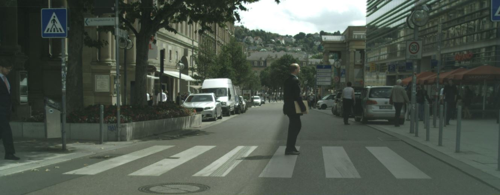
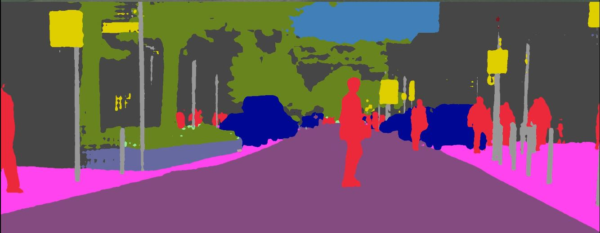

# Multi-Scale Atrous Spatial Pyramid Pooling for Larger and Denser receptive field in Semantic Segmentation

## Introduction
This code have simply upgraded code in the paper, "DenseASPP for Semantic Segmentation in Street Scenes". The paper don't have training code, only proposed model code so our team have implemented training code. But not simple training implementation code, our contribution is proposed. 

our team propose modified model(***Multi-Scale Atrous Spatial Pyramid Pooling for Larger and Denser receptive field in Semantic Segmentation***). This model and training code is so simple upgrade that low performance than semantic segmentation code after 2018.

However, our team is upgrading this code consistently and propose new semantic segmentation model.  
we will soon upgrade the code for it.

## Note!
Our team is still organizing the code, so the readability of the code is low.

## Qualitative Segmentation Result
### Raw image

### Predicted image

